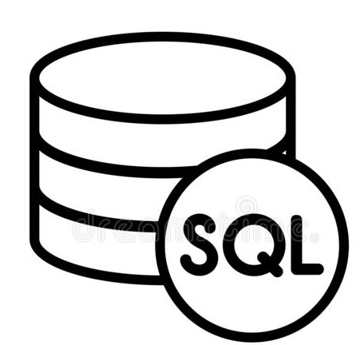

<h1> Welcome!  My name is Alessi Reiter 👩‍💻</h1>

 I'm a very creative yet analytical person excited to show off my newly found passion for software development!

## My skills:

## I'm currently learning:

## I want to learn:

## My Stats:

  
[(https://github-readme-stats.vercel.app/api/top-langs/?username=anoeller)]

<!-- (https://git.io/streak-stats)

[![Top Langs]](https://github.com/anoeller/github-readme-stats) -->

## Connect with me:

